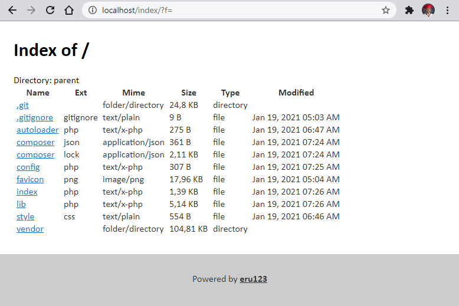

# PHP Directory Indexer using Linker


### Installing
change `<path>`  to where you want to extract the project
```bash
git clone https://github.com/eru123/php-directory-index <path>
```
Change directory to `<path>`
```bash
cd <path>
```
Install dependencies with composer
```bash
composer install
```
### Configuration
You can configure the projects setting on `/config.php`
```php

// Path of the directory you want to index
$dir = "path/to/your/dir";

// Columns you want to use
// Available columns are (name|ext|size|mime|type|modified)
$columns = ["name","ext","mime","size","type","modified"];

// Document title
$doc_title      = "PHP File Indexer";

// Page title
$page_title     = "Index of /";

// Page icon
$favicon        =  "favicon.png";

// Custom CSS you want to use
// NOTE: you can inject multiple css
$injected_css   = ["style.css"];
```